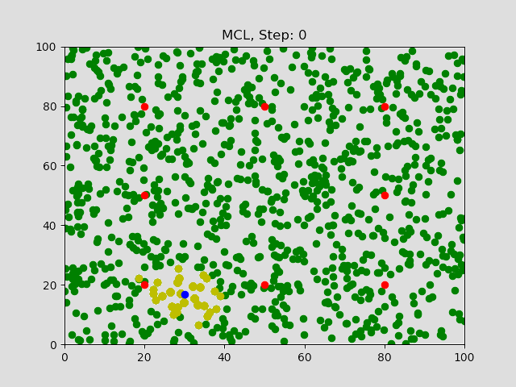
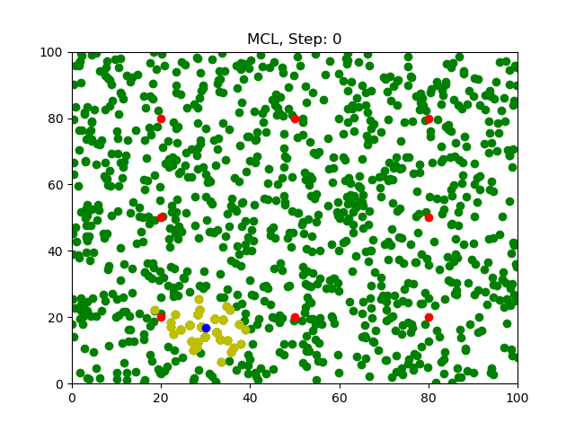
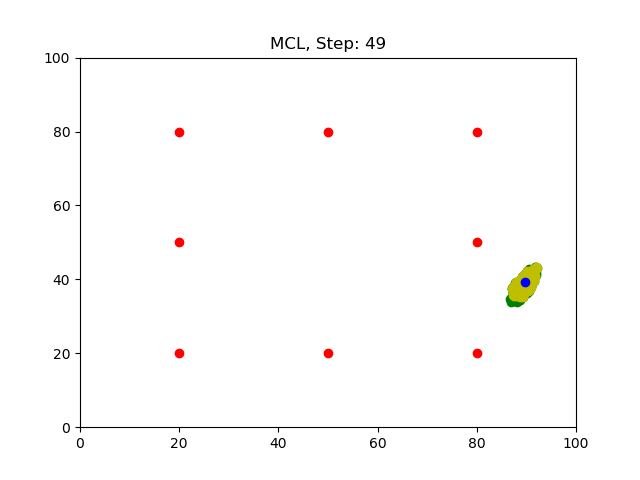

# Monte Carlo Localization
 
## Compiling the Program
```sh
$ mkdir build && cd build
$ cmake .. && make
$ ./MonteCarloLocalization
```

## Running the Program
Run the program from build directory.
```sh
$ ./MonteCarloLocalization
```
Wait for the program to iterate `50` times.

## Results
After running the program, `50` images will be generated in the `assets` folder.
### Step0

### Step49


